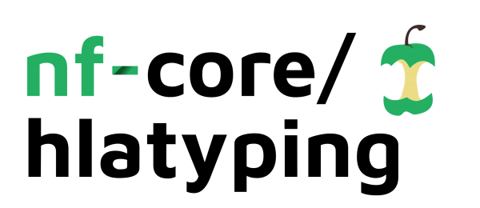

# 

[](https://github.com/nf-core/hlatyping/actions)
[](https://github.com/nf-core/hlatyping/actions)
[](https://www.nextflow.io/)
[](https://bioconda.github.io/)

[](https://hub.docker.com/r/nfcore/hlatyping)
[](https://nfcore.slack.com/channels/hlatyping)

## Introduction

The pipeline does next-generation sequencing-based Human Leukozyte Antigen (HLA) typing using [OptiType](https://github.com/FRED-2/OptiType). OptiType is a HLA genotyping algorithm based on integer linear programming. Reads of whole exome/genome/transcriptome sequencing data are mapped against a reference of known MHC class I alleles. To produce accurate 4-digit HLA genotyping predictions, all major and minor HLA-I loci are considered simultaneously to find an allele combination that maximizes the number of explained reads.

The pipeline is built using [Nextflow](https://www.nextflow.io), a workflow tool to run tasks across multiple compute infrastructures in a very portable manner. It comes with docker containers making installation trivial and results highly reproducible.

## Quick Start

1. Install [`nextflow`](https://nf-co.re/usage/installation)

2. Install either [`Docker`](https://docs.docker.com/engine/installation/) or [`Singularity`](https://www.sylabs.io/guides/3.0/user-guide/) for full pipeline reproducibility _(please only use [`Conda`](https://conda.io/miniconda.html) as a last resort; see [docs](https://nf-co.re/usage/configuration#basic-configuration-profiles))_

3. Download the pipeline and test it on a minimal dataset with a single command:

    ```bash
    nextflow run nf-core/hlatyping -profile test,<docker/singularity/conda/institute>
    ```

    > Please check [nf-core/configs](https://github.com/nf-core/configs#documentation) to see if a custom config file to run nf-core pipelines already exists for your Institute. If so, you can simply use `-profile <institute>` in your command. This will enable either `docker` or `singularity` and set the appropriate execution settings for your local compute environment.

4. Start running your own analysis!

    ```bash
    nextflow run nf-core/hlatyping -profile <docker/singularity/conda/institute> --input '*_R{1,2}.fastq.gz'
    ```

See [usage docs](docs/usage.md) for all of the available options when running the pipeline.

## Documentation

The nf-core/hlatyping pipeline comes with documentation about the pipeline which you can read at [https://nf-core/hlatyping/docs](https://nf-core/hlatyping/docs) or find in the [`docs/` directory](docs).

### Pipeline DAG

The hlatyping pipeline can currently deal with two input formats: `.fastq{.gz}` or `.bam`, not both at the same time however. If the input file type is `bam`, than the pipeline extracts all reads from it and performs an mapping additional step with the `yara` mapper against the HLA reference sequence. Indices are provided in the `./data` directory of this repository. Optitype uses [razers3](https://github.com/seqan/seqan/tree/master/apps/razers3), which is very memory consuming. In order to avoid memory issues during pipeline execution, we reduce the mapping information on the relevant HLA regions on chromosome 6.

#### DAG with `.fastq{.gz}` as input

Creates a config file from the command line arguments, which is then passed to OptiType. In parallel, the fastqs are unzipped if they are passed as archives. OptiType is then used for the HLA typing.


#### DAG with `.bam` as input

Creates a config file from the command line arguments, which is then passed to OptiType. In parallel, the reads are extracted from the bam file and mapped again against the HLA reference sequence on chromosome 6. OptiType is then used for the HLA typing.


## Credits

nf-core/hlatyping was originally written by [Christopher Mohr](https://github.com/christopher-mohr) from [Institute for Translational Bioinformatics](https://kohlbacherlab.org/team_tbi/) and [Quantitative Biology Center](https://uni-tuebingen.de/forschung/forschungsinfrastruktur/zentrum-fuer-quantitative-biologie-qbic/),  [Alexander Peltzer](https://github.com/apeltzer) from [Boeheringer Ingelheim](https://www.boehringer-ingelheim.de), and [Sven Fillinger](https://github.com/sven1103) from [Quantitative Biology Center](https://uni-tuebingen.de/forschung/forschungsinfrastruktur/zentrum-fuer-quantitative-biologie-qbic/).

## Contributions and Support

If you would like to contribute to this pipeline, please see the [contributing guidelines](.github/CONTRIBUTING.md).

For further information or help, don't hesitate to get in touch on the [Slack `#hlatyping` channel](https://nfcore.slack.com/channels/hlatyping) (you can join with [this invite](https://nf-co.re/join/slack)).

## Citation

If you use  nf-core/hlatyping for your analysis, please cite it using the following doi: [10.5281/zenodo.3258050](https://doi.org/10.5281/zenodo.3258050)

You can cite the `nf-core` publication as follows:

> **The nf-core framework for community-curated bioinformatics pipelines.**
>
> Philip Ewels, Alexander Peltzer, Sven Fillinger, Harshil Patel, Johannes Alneberg, Andreas Wilm, Maxime Ulysse Garcia, Paolo Di Tommaso & Sven Nahnsen.
>
> _Nat Biotechnol._ 2020 Feb 13. doi: [10.1038/s41587-020-0439-x](https://dx.doi.org/10.1038/s41587-020-0439-x).
> ReadCube: [Full Access Link](https://rdcu.be/b1GjZ)
