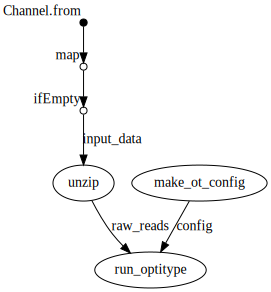
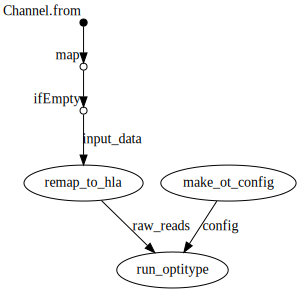

# 
Precision HLA typing from next-generation sequencing data using [OptiType](https://github.com/FRED-2/OptiType).

[](https://travis-ci.org/nf-core/hlatyping)
[](https://www.nextflow.io/)
[](https://zenodo.org/badge/latestdoi/140573587)

[](http://bioconda.github.io/)
[](https://hub.docker.com/r/nfcore/hlatyping)
[](https://singularity-hub.org/collections/1251)


# Table of Contents

1. [Introduction](#introduction)
2. [Quick Start](#hotrun)
   * [With Docker](#hrdocker)
   * [With Singularity](#hrsingularity)
3. [Documentation](docs/README.md)
4. [Pipeline DAG](#dag)
   * [Input `fastq`](#dagfastq)
   * [Input `bam`](#dagbam)
5. [Credits](#credits)


### <a name="introduction"></a>Introduction
OptiType is a HLA genotyping algorithm based on integer linear programming. Reads of whole exome/genome/transcriptome sequencing data are mapped against a reference of known MHC class I alleles. To produce accurate 4-digit HLA genotyping predictions, all major and minor HLA-I loci are considered simultaneously to find an allele combination that maximizes the number of explained reads.  

The pipeline is built using [Nextflow](https://www.nextflow.io), a workflow tool to run tasks across multiple compute infrastructures in a very portable manner. It comes with docker / singularity containers making installation trivial and results highly reproducible.

### <a name="hotrun"></a>Quick Start

If you want to test with a single line, if the pipeline works on your system, follow the next commands, with pre-configured test data-sets.

<a name="hrdocker"></a>**Docker**

```bash
nextflow run nf-core/hlatyping -profile docker,test --outdir $PWD/results
```

<a name="hrsingularity"></a>**Singularity**

```bash
nextflow run nf-core/hlatyping -profile singularity,test --outdir $PWD/results
```

### <a name="documentation"></a>Documentation
The nf-core/hlatyping pipeline comes with documentation about the pipeline, found in the `docs/` directory:

1. [Installation](docs/installation.md)
2. Pipeline configuration
    * [Local installation](docs/configuration/local.md)
    * [Adding your own system](docs/configuration/adding_your_own.md)
3. [Running the pipeline](docs/usage.md)
4. [Output and how to interpret the results](docs/output.md)
5. [Troubleshooting](docs/troubleshooting.md)

### <a name="dag"></a> Pipeline DAG

The hlatyping pipeline can currently deal with two input formats: `.fastq{.gz}` or `.bam`, not both at the same time however. If the input file type is `bam`, than the pipeline extracts all reads from it and performs an mapping additional step with the `yara` mapper against the HLA reference sequence. Indices are provided in the `./data` directory of this repository. Optitype uses [razers3](https://github.com/seqan/seqan/tree/master/apps/razers3), which is very memory consuming. In order to avoid memory issues during pipeline execution, we reduce the mapping information on the relevant HLA regions on chromosome 6.

<a name="dagfastq"></a>**DAG with `.fastq{.gz}` as input**

Creates a config file from the command line arguments, which is then passed to OptiType. In parallel, the fastqs are unzipped if they are passed as archives. OptiType is then used for the HLA typing.



<a name="dagbam"></a>**DAG with `.bam` as input**

Creates a config file from the command line arguments, which is then passed to OptiType. In parallel, the reads are extracted from the bam file and mapped again against the HLA reference sequence on chromosome 6. OptiType is then used for the HLA typing.



### <a name="credits"></a>Credits

This pipeline was written by:

* Sven Fillinger ([sven1103](https://github.com/sven1103)) at [QBiC](http://qbic.life)
* Christopher Mohr ([christopher-mohr](https://github.com/christopher-mohr)) at [QBiC](http://qbic.life).
