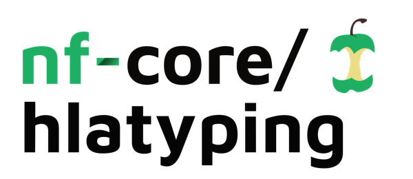
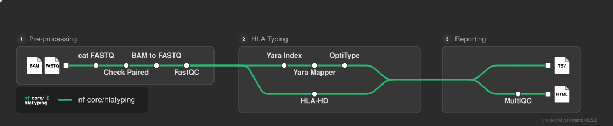

<h1>
  <picture>
    <source media="(prefers-color-scheme: dark)" srcset="docs/images/nf-core-hlatyping_logo_dark.png">
    
  </picture>
</h1>

[](https://github.com/codespaces/new/nf-core/hlatyping)
[](https://github.com/nf-core/hlatyping/actions/workflows/ci.yml)
[](https://github.com/nf-core/hlatyping/actions/workflows/linting.yml)[](https://nf-co.re/hlatyping/results)[](https://doi.org/10.5281/zenodo.1401039)
[](https://www.nf-test.com)

[](https://www.nextflow.io/)
[](https://github.com/nf-core/tools/releases/tag/4.0.2)
[](https://docs.conda.io/en/latest/)
[](https://www.docker.com/)
[](https://sylabs.io/docs/)
[](https://cloud.seqera.io/launch?pipeline=https://github.com/nf-core/hlatyping)

[](https://nfcore.slack.com/channels/hlatyping)[](https://bsky.app/profile/nf-co.re)[](https://mstdn.science/@nf_core)[](https://www.youtube.com/c/nf-core)

## Introduction

**nf-core/hlatyping** is a bioinformatics pipeline that can be used to perform HLA typing from next-generation sequencing or immunopeptidomics data. It supports five HLA typing tools, selectable via `--tools` (OptiType is run by default if `--tools` is not set):

- [**OptiType**](https://github.com/FRED-2/OptiType) (open-source): HLA Class I genotyping based on integer linear programming from FASTQ or BAM input.
- [**HLA-HD**](https://w3.genome.med.kyoto-u.ac.jp/HLA-HD/) (requires local installation): HLA Class I + II typing from FASTQ or BAM input.
- [**HLA\*LA**](https://github.com/DiltheyLab/HLA-LA) (open-source): HLA typing from BAM files using a population reference graph of the MHC region.
- [**SpecHLA**](https://github.com/deepomicslab/SpecHLA) (open-source): HLA Class I + II typing across all 8 loci from a genome-aligned BAM input.
- [**Immunotype**](https://github.com/AG-Walz/immunotype) (open-source): HLA Class I prediction from immunopeptidomics peptide sequences (TSV input).

The pipeline is built using [Nextflow](https://www.nextflow.io), a workflow tool to run tasks across multiple compute infrastructures in a very portable manner. It uses Docker/Singularity containers making installation trivial and results highly reproducible. The [Nextflow DSL2](https://www.nextflow.io/docs/latest/dsl2.html) implementation of this pipeline uses one container per process which makes it much easier to maintain and update software dependencies. Where possible, these processes have been submitted to and installed from [nf-core/modules](https://github.com/nf-core/modules) in order to make them available to all nf-core pipelines, and to everyone within the Nextflow community!

On release, automated continuous integration tests run the pipeline on a full-sized dataset on the AWS cloud infrastructure. This ensures that the pipeline runs on AWS, has sensible resource allocation defaults set to run on real-world datasets, and permits the persistent storage of results to benchmark between pipeline releases and other analysis sources.The results obtained from the full-sized test can be viewed on the [nf-core website](https://nf-co.re/hlatyping/results).



## Pipeline summary

1. Merge FastQ files ([`cat`](http://www.linfo.org/cat.html))
2. Read QC ([`FastQC`](https://www.bioinformatics.babraham.ac.uk/projects/fastqc/))
3. Generate reference indices ([`yara`](https://www.seqan.de/apps/yara.html))
4. Map reads to reference ([`yara`](https://www.seqan.de/apps/yara.html))
5. HLA typing with any combination of (selected via `--tools`, default: `optitype`):
   - HLA class I typing ([`OptiType`](https://github.com/FRED-2/OptiType))
   - HLA class I+II typing ([`HLA-HD`](https://w3.genome.med.kyoto-u.ac.jp/HLA-HD/), requires local installation)
   - HLA typing from BAM ([`HLA*LA`](https://github.com/DiltheyLab/HLA-LA))
   - HLA class I+II typing from genome-aligned BAM ([`SpecHLA`](https://github.com/deepomicslab/SpecHLA))
   - HLA class I typing from immunopeptidomics peptides ([`Immunotype`](https://github.com/AG-Walz/immunotype))
6. Present QC for raw reads ([`MultiQC`](http://multiqc.info/))

## Usage

> [!NOTE]
> If you are new to Nextflow and nf-core, please refer to [this page](https://nf-co.re/docs/get_started/environment_setup/overview) on how to set-up Nextflow. Make sure to [test your setup](https://nf-co.re/docs/get_started/run-your-first-pipeline) with `-profile test` before running the workflow on actual data.

First, prepare a samplesheet with your input data that looks as follows:

`samplesheet.csv`:

```csv
sample,fastq_1,fastq_2,seq_type
CONTROL_REP1,AEG588A1_S1_L002_R1_001.fastq.gz,AEG588A1_S1_L002_R2_001.fastq.gz,dna
```

Each row represents a sample and its fastq file (single-end) or a pair of fastq files (paired end) and the sequencing type. The sample identifiers have to be specified with the fastq files and the sequencing type, i.e. `dna` or `rna`. It is also possible to provide reads as `bam` file by adding a column `bam` in which the file path will be specified. The fastq columns have to be kept.

The pipeline will auto-detect whether a sample is single- or paired-end using the information provided in the samplesheet.

Now, you can run the pipeline using:

```bash
nextflow run nf-core/hlatyping \
   -profile <docker/singularity/.../institute> \
   --input samplesheet.csv \
   --outdir <OUTDIR>
```

> [!WARNING]
> Please provide pipeline parameters via the CLI or Nextflow `-params-file` option. Custom config files including those provided by the `-c` Nextflow option can be used to provide any configuration _**except for parameters**_; see [docs](https://nf-co.re/docs/running/run-pipelines#using-parameter-files).

For more details and further functionality, please refer to the [usage documentation](https://nf-co.re/hlatyping/usage) and the [parameter documentation](https://nf-co.re/hlatyping/parameters).

## Pipeline output

To see the results of an example test run with a full size dataset refer to the [results](https://nf-co.re/hlatyping/results) tab on the nf-core website pipeline page.
For more details about the output files and reports, please refer to the
[output documentation](https://nf-co.re/hlatyping/output).

## Credits

nf-core/hlatyping was originally written by [Christopher Mohr](https://github.com/christopher-mohr) from [Medical Data Integration Center](https://www.medizin.uni-tuebingen.de/de/das-klinikum/einrichtungen/institute/informationstechnologie-und-medizininformatik/medic) and [Quantitative Biology Center](https://uni-tuebingen.de/forschung/forschungsinfrastruktur/zentrum-fuer-quantitative-biologie-qbic/), [Alexander Peltzer](https://github.com/apeltzer) from [Boehringer Ingelheim](https://www.boehringer-ingelheim.de), and [Sven Fillinger](https://github.com/sven1103) from [Quantitative Biology Center](https://uni-tuebingen.de/forschung/forschungsinfrastruktur/zentrum-fuer-quantitative-biologie-qbic/).

## Contributions and Support

If you would like to contribute to this pipeline, please see the [contributing guidelines](docs/CONTRIBUTING.md).

For further information or help, don't hesitate to get in touch on the [Slack `#hlatyping` channel](https://nfcore.slack.com/channels/hlatyping) (you can join with [this invite](https://nf-co.re/join/slack)).

## Citations

If you use nf-core/hlatyping for your analysis, please cite it using the following doi: [10.5281/zenodo.1401039](https://doi.org/10.5281/zenodo.1401039)

An extensive list of references for the tools used by the pipeline can be found in the [`CITATIONS.md`](CITATIONS.md) file.

You can cite the `nf-core` publication as follows:

> **The nf-core framework for community-curated bioinformatics pipelines.**
>
> Philip Ewels, Alexander Peltzer, Sven Fillinger, Harshil Patel, Johannes Alneberg, Andreas Wilm, Maxime Ulysse Garcia, Paolo Di Tommaso & Sven Nahnsen.
>
> _Nat Biotechnol._ 2020 Feb 13. doi: [10.1038/s41587-020-0439-x](https://dx.doi.org/10.1038/s41587-020-0439-x).
