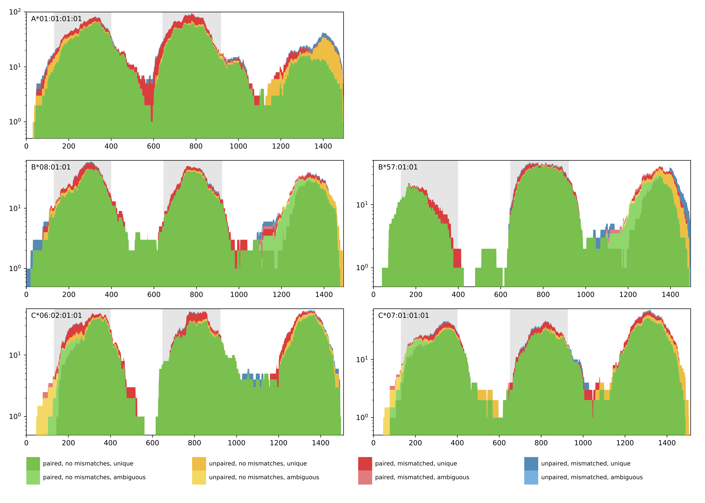

# nf-core/hlatyping: Output

## Introduction

This document describes the output produced by the pipeline. Most of the plots are taken from the MultiQC report, which summarises results at the end of the pipeline.

The directories listed below will be created in the results directory after the pipeline has finished. All paths are relative to the top-level results directory.

## Pipeline overview

The pipeline is built using [Nextflow](https://www.nextflow.io/) and processes data using the following steps:

- [cat](#cat) - Merge FastQ files
- [FastQC](#fastqc) - Raw read QC
- [OptiType](#optitype) - HLA genotyping based on integer linear programming
- [HLA-HD](#hla-hd) - HLA Class I + II genotyping (optional, requires a local installation of HLA-HD)
- [HLA\*LA](#hlala) - HLA typing from BAM files using a graph-based approach (optional)
- [SpecHLA](#spechla) - Full-resolution HLA Class I + II typing with phased per-locus haplotypes (optional)
- [MultiQC](#multiqc) - Aggregate report describing results from the whole pipeline
- [Pipeline information](#pipeline-information) - Report metrics generated during the workflow execution

### cat

<details markdown="1">
<summary>Output files</summary>

- `fastq/`
  - `*.merged.fastq.gz`: If `--save_merged_fastq` is specified, concatenated FastQ files will be placed in this directory.

</details>

If multiple libraries/runs have been provided for the same sample in the input samplesheet (e.g. to increase sequencing depth) then these will be merged at the very beginning of the pipeline in order to have consistent sample naming throughout the pipeline. Please refer to the [usage documentation](https://nf-co.re/rnaseq/usage#samplesheet-input) to see how to specify these samples in the input samplesheet.

### FastQC

<details markdown="1">
<summary>Output files</summary>

- `fastqc/`
  - `*_fastqc.html`: FastQC report containing quality metrics.
  - `*_fastqc.zip`: Zip archive containing the FastQC report, tab-delimited data file and plot images.

</details>

[FastQC](http://www.bioinformatics.babraham.ac.uk/projects/fastqc/) gives general quality metrics about your sequenced reads. It provides information about the quality score distribution across your reads, per base sequence content (%A/T/G/C), adapter contamination and overrepresented sequences. For further reading and documentation see the [FastQC help pages](http://www.bioinformatics.babraham.ac.uk/projects/fastqc/Help/).

### OptiType

[OptiType](https://github.com/FRED-2/OptiType) is an HLA genotyping algorithm based on linear integer programming. It provides accurate 4-digit HLA genotyping predictions from NGS data.
For further reading and documentation see the [OptiType documentation](https://github.com/FRED-2/OptiType).

The pipeline results contain a CSV file with the predicted HLA genotype. Each line contains one solution with the predicted HLA alleles in 4-digit nomenclature, the number of reads that are covered by this solution and the objective function value. If the number of enumerations (--enumerate N) is higher than 1, the CSV file will contain the optimal and sub-optimal solutions.

```tsv
    A1  A2  B1  B2  C1  C2  Reads   Objective
0   A*01:01 A*01:01 B*08:01 B*57:01 C*07:01 C*06:02 1127.0  1106.7139999999997
```

Additionally, a coverage plot of the predicted HLA genotype is produced for quality control purposes (see below). The coverage plot shows the amount of reads that cover every position of the selected HLA allele sequence. Further, the color encoding denotes if reads are paired or unpaired, contain mismatches, and if the matches are unique or ambiguous. In case of homozygous solutions, the coverage plot of the corresponding HLA allele will be shown once.



### HLA-HD

[HLA-HD](https://w3.genome.med.kyoto-u.ac.jp/HLA-HD/) (HLA typing from High-quality Dictionary) is an HLA genotyping algorithm that utilizes an extensive dictionary of HLA alleles and a unique mapping strategy. It calculates scores based on weighted read counts to select the most suitable allele pairs. Unlike many other tools, HLA-HD can provide accurate HLA genotyping predictions with up to 6-digit (3-field) precision from WGS, WES, and RNA-Seq data.
For further reading and documentation see the [HLA-HD website](https://w3.genome.med.kyoto-u.ac.jp/HLA-HD/).

> **Note:** HLA-HD is not distributed with the pipeline's containers due to licensing restrictions. The software is freely available for academic and non-commercial research purposes, but users must register and download it directly from the provider. Commercial use requires a specific license.

The pipeline results contain a text file (`*_final.result.txt`) with the predicted HLA genotype. Each line represents a specific HLA gene locus and contains the best-matched allele pair in up to 6-digit nomenclature.

```tsv
A A*24:02:01:01 A*33:03:01
B B*44:03:01  B*58:01:01:01
C C*03:02:02:01 C*14:03
DRB1  DRB1*04:05:01 DRB1*13:02:01
DQB1  DQB1*04:01:01 DQB1*06:04:01
DPB1  DPB1*04:01:01:01  DPB1*04:02:01:01
...
```

**Output directory: `results/{timestamp}`**

- `{prefix}_{timestamp}_result.tsv`
  - TSV file, containing the predicted optimal (anf if enumerated, sub-optimal) HLA genotype
- `{prefix}_{timestamp}_coverage_plot.pdf`
  - pdf file, containing a coverage plot of the predicted alleles

### HLA\*LA

[HLA\*LA](https://github.com/DiltheyLab/HLA-LA) (HLA typing using a graph-based reference) performs HLA typing directly from BAM files using a population reference graph of the MHC region. It supports typing of Class I and Class II HLA alleles.

> **Note:** HLA\*LA requires BAM file input and will only run for samples that provide a BAM file in the samplesheet. The tool uses a large graph reference (~5 GB) that is either downloaded automatically or provided by the user.

<details markdown="1">
<summary>Output files</summary>

- `hlala/`
  - `<sample_id>/`: Directory containing HLA\*LA typing results including:
    - `hla/R1_bestguess_G.txt`: Best-guess HLA genotype calls at G-group resolution.
    - `hla/R1_bestguess.txt`: Best-guess HLA genotype calls.
    - `reads_per_level.txt`: Read counts at each level of the typing hierarchy.

</details>

### SpecHLA

[SpecHLA](https://github.com/deepomicslab/SpecHLA) is an open-source, full-resolution HLA typing tool that reconstructs phased per-locus haplotypes from paired-end short reads. It covers HLA class I (A, B, C) and class II (DPA1, DPB1, DQA1, DQB1, DRB1) at 4-field resolution and works on DNA WGS, WES, and RNA-seq.

<details markdown="1">
<summary>Output files</summary>

- `spechla/<sample>/`
  - `hla.result.txt` — final HLA typing call (one row per locus, 4-field resolution)
  - `hla.result.details.txt` — all candidate alleles with mapping scores
  - `hla.result.g.group.txt` — G-group resolution call (when available)
  - `HLA_*_freq.txt` — per-locus haplotype frequencies

</details>

Notes:

- SpecHLA requires paired-end input. Combining `--tools spechla` with any single-end sample fails the run at parameter validation.
- SpecHLA runs in exon typing mode (`-u 1`) for every sample, which is correct for WES and RNA-seq. Whole-genome users can override to full-length mode (`-u 0`) — see the [`SpecHLA-specific notes`](usage.md#spechla-specific-notes) in `docs/usage.md`.

### Immunotype

[Immunotype](https://github.com/AG-Walz/immunotype) predicts HLA class I alleles directly from a list of immunopeptidomics peptide sequences. It takes the `tsv` samplesheet column as input (MHCquant-style or a headerless peptide list — see the [usage docs](usage.md#samplesheet-input)) and is selected via `--tools immunotype`.

**Output directory: `immunotype/`**

- `{prefix}_typing.tsv` — two-column TSV with the predicted HLA class I alleles joined by `;`

```tsv
sample  typing
sample_0  HLA-A*02:01;HLA-A*24:02;HLA-B*51:08;HLA-C*04:01;HLA-C*16:02
```

### MultiQC

<details markdown="1">
<summary>Output files</summary>

- `multiqc/`
  - `multiqc_report.html`: a standalone HTML file that can be viewed in your web browser.
  - `multiqc_data/`: directory containing parsed statistics from the different tools used in the pipeline.
  - `multiqc_plots/`: directory containing static images from the report in various formats.

</details>

[MultiQC](http://multiqc.info) is a visualization tool that generates a single HTML report summarising all samples in your project. Most of the pipeline QC results are visualised in the report and further statistics are available in the report data directory.

Results generated by MultiQC collate pipeline QC from supported tools e.g. FastQC. The pipeline has special steps which also allow the software versions to be reported in the MultiQC output for future traceability. For more information about how to use MultiQC reports, see <http://multiqc.info>.

### Pipeline information

<details markdown="1">
<summary>Output files</summary>

- `pipeline_info/`
  - Reports generated by Nextflow: `execution_report.html`, `execution_timeline.html`, `execution_trace.txt` and `pipeline_dag.dot`/`pipeline_dag.svg`.
  - Reports generated by the pipeline: `pipeline_report.html`, `pipeline_report.txt` and `software_versions.yml`. The `pipeline_report*` files will only be present if the `--email` / `--email_on_fail` parameter's are used when running the pipeline.
  - Reformatted samplesheet files used as input to the pipeline: `samplesheet.valid.csv`.
  - Parameters used by the pipeline run: `params.json`.

</details>

[Nextflow](https://www.nextflow.io/docs/latest/tracing.html) provides excellent functionality for generating various reports relevant to the running and execution of the pipeline. This will allow you to troubleshoot errors with the running of the pipeline, and also provide you with other information such as launch commands, run times and resource usage.
